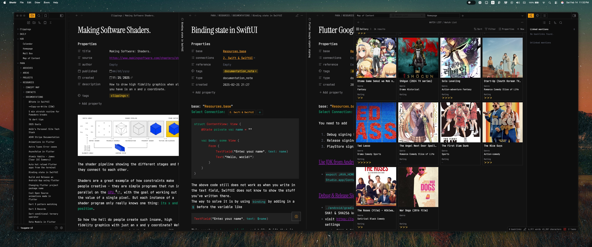
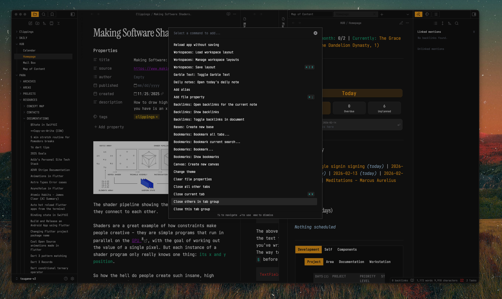
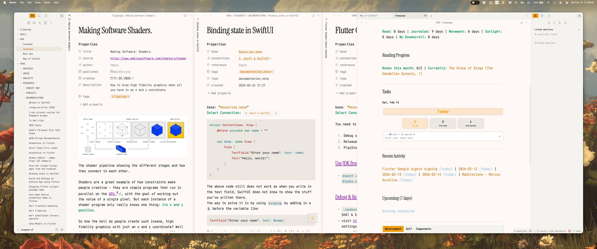
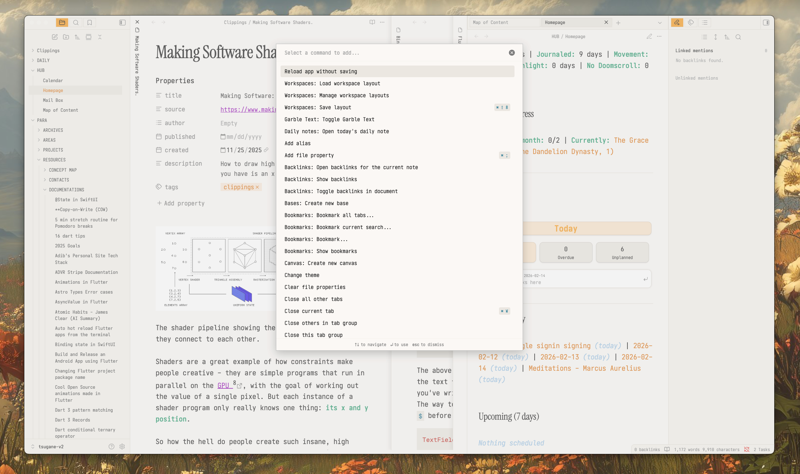

# Tsugane

A minimal, sharp-edged Obsidian theme with a dark mode based on the [Matteblack Neovim](https://github.com/matteblack/neovim) colorscheme and a warm cream light mode.






## Features

- **Dark Mode**: Direct port of the Matteblack Neovim palette - deep blacks, muted grays, and warm accents
- **Light Mode**: Complementary warm cream tones for comfortable daytime reading
- **Sharp Aesthetic**: Editorial, flat design with `0px` border radius by default
- **Smooth Animations**: Subtle 300ms transitions throughout
- **Minimal Dataview Tables**: Clean, borderless tables with uppercase headers
- **Custom Tab Styling**: Floating tab bar with orange active states
- **Typography**: Instrument Serif headings, Zenbones Brainy body text

## Color Palette

### Dark Mode (Matteblack)

| Role       | Color     |
| ---------- | --------- |
| Background | `#0D0D0D` |
| Surface    | `#141414` |
| Accent     | `#F59E0B` |
| Bold       | `#059669` |
| Italic     | `#A1C7E5` |
| Text       | `#E0E0E0` |

### Light Mode (Warm Cream)

| Role       | Color     |
| ---------- | --------- |
| Background | `#FAF8F5` |
| Surface    | `#F5F2ED` |
| Accent     | `#D97706` |
| Bold       | `#047857` |
| Italic     | `#1E6BA1` |
| Text       | `#1A1A1A` |

## Customization

The theme is designed to be easily customizable. Key variables are at the top of `theme.css`:

### Border Radius

```css
--tsugane-radius-base: 0px; /* Change to 4px, 8px, etc. for rounded corners */
```

### Animation Speed

```css
--tsugane-transition-fast: 150ms;
--tsugane-transition-normal: 300ms;
--tsugane-transition-slow: 500ms;
```

### Fonts

```css
--tsugane-font-body: "Zenbones Brainy", "Geist", "Inter", system-ui;
--tsugane-font-heading: "Instrument Serif", Georgia, serif;
--tsugane-font-mono: "Zenbones Brainy Mono", "Geist Mono", "SF Mono", monospace;
```

## Installation

### From Obsidian Community Themes

1. Open Obsidian Settings
2. Go to Appearance > Themes
3. Click "Manage" and search for "Tsugane"
4. Click "Install and use"

### Manual Installation

1. Download `theme.css` and `manifest.json`
2. Create a folder called `Tsugane` in your vault's `.obsidian/themes/` directory
3. Place both files in the `Tsugane` folder
4. Open Obsidian Settings > Appearance and select "Tsugane"

## Recommended Fonts

For the best experience, install these fonts:

- [Instrument Serif](https://fonts.google.com/specimen/Instrument+Serif) - Headings
- [Zenbones Brainy](https://github.com/zenbones-theme/zenbones-nvim) - Body text (optional)
- [Geist](https://vercel.com/font) - Fallback body text

## Credits

- Dark mode palette inspired by [Matteblack Neovim](https://github.com/matteblack/neovim)
- Built for personal use, shared with the community

## License

MIT License - feel free to modify and share.

---

Made by [Adib Ashraf](https://adibashraf.me)
